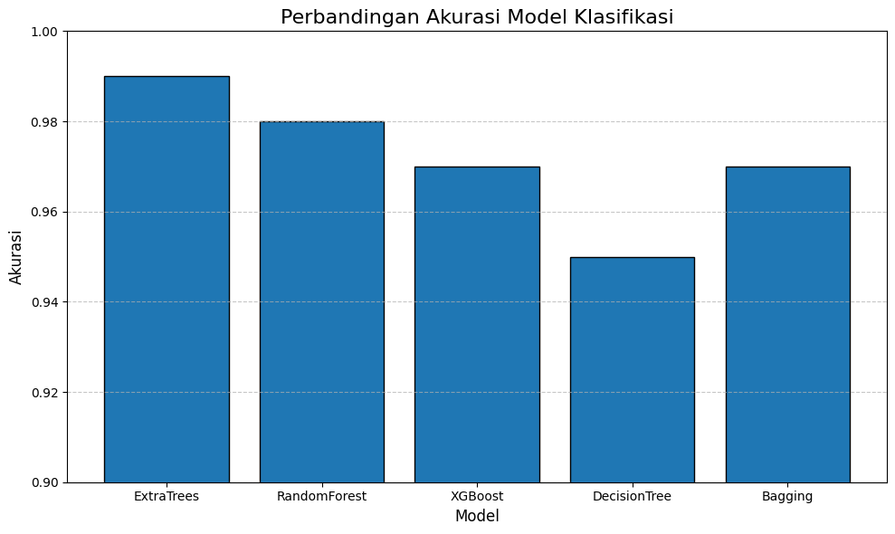

# Laporan Proyek Machine Learning Terapan - Tiesya Andriani Ramadhanti

## Domain Proyek: Kesehatan

### Latar Belakang
Kanker payudara merupakan penyebab kematian tertinggi akibat kanker pada perempuan di seluruh dunia. Meskipun banyak penelitian berfokus pada deteksi dini kanker payudara, tantangan besar lainnya adalah memahami dan memprediksi kelangsungan hidup pasien setelah diagnosis. Prediksi yang akurat terhadap kemungkinan seorang pasien bertahan hidup dapat membantu dalam perencanaan perawatan, pengambilan keputusan klinis, serta memfokuskan sumber daya medis secara lebih efektif.Penerapan machine learning dalam bidang kesehatan telah menunjukkan potensi yang besar dalam meningkatkan akurasi diagnosis dan prognosis. Studi oleh Pires et al. (2021) menunjukkan bahwa algoritma machine learning seperti Support Vector Machine, Random Forest, dan Logistic Regression dapat mencapai akurasi tinggi dalam klasifikasi diagnosis kanker payudara (ganas atau jinak). Meskipun studi tersebut fokus pada tahap diagnosis, pendekatan yang sama dapat diperluas untuk prediksi kelangsungan hidup pasien, dengan menggunakan data klinis lanjutan seperti ukuran tumor, jumlah node limfa positif, dan lama bertahan hidup.
Dengan memanfaatkan data klinis dan algoritma machine learning, proyek ini bertujuan untuk membangun model prediksi yang dapat mengklasifikasikan pasien kanker payudara ke dalam dua kelompok utama: alive atau dead. Model ini diharapkan dapat membantu dalam penyusunan strategi perawatan yang lebih tepat sasaran dan personalisasi pengobatan bagi penderita kanker payudara.

### Referensi
- Pires, F. G., de Sousa, R. T., Ferreira, K. P., Andrade, R. M. C., & Pereira, A. G. (2021). Machine Learning Algorithms for Breast Cancer Prediction and Diagnosis. *Procedia Computer Science, 191*, 487–492. https://doi.org/10.1016/j.procs.2021.07.062

- World Health Organization. (2021). *Breast cancer*. Retrieved from https://www.who.int/news-room/fact-sheets/detail/breast-cancer

## Business Understanding

### Problem Statements

- Bagaimana memprediksi status kelangsungan hidup pasien kanker payudara (Alive atau Dead) berdasarkan data klinis seperti ukuran tumor, jumlah kelenjar getah bening positif, dan lama bertahan hidup?
- Fitur klinis mana yang paling berpengaruh terhadap prediksi status pasien?
- Algoritma klasifikasi mana yang memberikan performa terbaik dalam tugas prediksi tersebut?

### Goals

- Mengembangkan model klasifikasi machine learning untuk memprediksi status hidup atau meninggal pasien kanker payudara.
- Mengidentifikasi fitur klinis yang paling berkontribusi terhadap prediksi model.
- Membandingkan performa beberapa algoritma klasifikasi (AdaBoost, LDA, Random Forest, Logistic Regression, dan LGBM) guna menemukan model terbaik berdasarkan metrik evaluasi.

### Solution Statements

Untuk mencapai tujuan proyek, beberapa langkah solusi dirancang dan diimplementasikan sebagai berikut:

1. **Proses Data Preprocessing**
   - Menghapus outlier untuk meningkatkan kualitas data dan stabilitas model.
   - Melakukan encoding pada variabel kategorikal agar dapat digunakan oleh algoritma machine learning.
   - Menyeimbangkan dataset dengan teknik undersampling untuk mengatasi class imbalance antara status 'Alive' dan 'Dead'.
   - Membagi data menjadi set pelatihan dan pengujian untuk validasi performa model.

2. **Penerapan dan Perbandingan Algoritma Klasifikasi**
   
   Lima algoritma machine learning digunakan dan dibandingkan performanya:
   - **ExtraTreesClassifier**  : Algoritma ensemble yang menggunakan banyak pohon keputusan dengan pembangkitan acak untuk meningkatkan variasi dan mengurangi overfitting.
   - **RandomForestClassifier** : Ensemble pohon keputusan dengan teknik bagging dan pemilihan fitur acak untuk stabilitas dan akurasi yang tinggi.
   - **XGBClassifier** : Algoritma gradient boosting yang membangun pohon secara berurutan untuk mengoreksi kesalahan model sebelumnya dengan efisiensi tinggi.
   - **DecisionTreeClassifier** : Model pohon keputusan tunggal yang mudah diinterpretasi namun rentan overfitting tanpa pembatasan.
   - **BaggingClassifier** : Metode ensemble yang membangun beberapa model dasar pada subset data acak dan menggabungkan hasilnya untuk mengurangi varians.

3. **Evaluasi Model**
   
   Kinerja masing-masing model diukur menggunakan beberapa metrik evaluasi klasifikasi:
   - **Accuracy**: Mengukur proporsi prediksi yang benar dari total prediksi.
   - **Precision** dan **Recall**: Digunakan untuk memahami trade-off antara false positives dan false negatives.
   - **F1-Score**: Rata-rata harmonis antara precision dan recall, cocok untuk data dengan distribusi kelas yang tidak seimbang.

Model dengan performa terbaik berdasarkan metrik evaluasi akan dipilih sebagai solusi akhir dari proyek ini.

## Data Understanding
### Informasi Dataset

| Keterangan       | Detail                            |
|------------------|------------------------------------|
| Jumlah data      | 4024 baris                        |
| Jumlah fitur     | 16 kolom                          |
| Target           | `Status` (Alive / Dead)           |
| Format           | CSV                               |
| Sumber           |[Kaggle - Breast Cancer Survival Dataset] (https://www.kaggle.com/datasets/reihanenamdari/breast-cancer) |

### Contoh Data
| Age | Race                | Marital Status | T Stage | N Stage | 6th Stage | differentiate | Grade | A Stage | Tumor Size | Estrogen Status | Progesterone Status | Regional Node Examined | Reginol Node Positive | Survival Months | Status |
|-----|---------------------|----------------|---------|---------|-----------|---------------|-------|---------|------------|-----------------|---------------------|-----------------------|-----------------------|-----------------|-----|
| 59  | White               | Married        | T2      | N0      | IIA       | Moderate      | 2     | II      | 35         | Positive        | Positive            | 3                     | 0                     | 85              |Alive|
| 65  | Black               | Single         | T3      | N1      | IIIA      | Poor          | 3     | III     | 45         | Negative        | Negative            | 6                     | 3                     | 40              | Dead   |
| 47  | Asian/Pacific Islander | Married      | T1      | N0      | IB        | Well          | 1     | I       | 12         | Positive        | Positive            | 1                     | 0                     | 120             | Alive  |
| 58  | White               | Widowed        | T2      | N2      | IIB       | Moderate      | 2     | II      | 30         | Negative        | Positive            | 4                     | 2                     | 60              | Dead   |
| 62  | Hispanic            | Married        | T2      | N0      | IIA       | Poor          | 3     | II      | 40         | Positive        | Negative            | 2                     | 1                     | 75              | Alive  |

### Deskripsi Fitur

Berikut adalah penjelasan dari masing-masing fitur pada dataset:

- `Age`: Usia pasien dalam tahun.
- `Race`: Ras pasien (White, Black, Asian/Pacific Islander, dll).
- `Marital Status`: Status pernikahan pasien (Married, Single, Widowed, dll).
- `T Stage`: Stadium tumor primer berdasarkan ukuran (T1, T2, T3, dll).
- `N Stage`: Stadium nodus limfa regional (N0, N1, N2, dll).
- `6th Stage`: Stadium kanker menurut klasifikasi AJCC edisi ke-6 (misalnya IIA, IIB, IIIA).
- `differentiate`: Tingkat diferensiasi sel tumor (Well, Moderate, Poor, Undifferentiated).
- `Grade`: Tingkat keparahan sel kanker (1 = well differentiated, 2 = moderately differentiated, 3 = poorly differentiated).
- `A Stage`: Stadium kanker akhir (Stage I, II, III, IV).
- `Tumor Size`: Ukuran tumor dalam milimeter.
- `Estrogen Status`: Status reseptor estrogen (Positive/Negative).
- `Progesterone Status`: Status reseptor progesteron (Positive/Negative).
- `Regional Node Examined`: Jumlah kelenjar getah bening yang diperiksa.
- `Reginol Node Positive`: Jumlah kelenjar getah bening yang positif (mengandung sel kanker).
- `Survival Months`: Lama kelangsungan hidup pasien setelah diagnosis (dalam bulan).
- `Status`: Target variabel – status kelangsungan hidup pasien (`Alive` atau `Dead`).

Beberapa tahapan eksplorasi data telah dilakukan untuk memahami karakteristik dataset, antara lain:

#### 1. Visualisasi Boxplot untuk Mengidentifikasi Outliers

  
Berdasarkan visualisasi boxplot pada beberapa fitur numerik dalam dataset, mayoritas pasien berusia antara 47 hingga 65 tahun dengan usia minimum sekitar 30 tahun dan tidak terdapat outlier signifikan pada fitur usia. Untuk ukuran tumor, sebagian besar berada di rentang 15 hingga 40 mm, namun terdapat banyak outlier di atas 70 mm yang menunjukkan adanya pasien dengan ukuran tumor yang jauh lebih besar. 
Pada fitur jumlah kelenjar getah bening yang diperiksa (Regional Node Examined), mayoritas pasien memiliki antara 5 hingga 25 kelenjar, namun beberapa pasien memiliki jumlah kelenjar diperiksa lebih dari 50 sebagai outlier. Sedangkan untuk jumlah kelenjar getah bening positif (Regional Node Positive), mayoritas pasien memiliki 0 hingga 5 kelenjar positif, tetapi terdapat banyak outlier dengan jumlah positif lebih dari 10 hingga lebih dari 40. Masa bertahan hidup pasien (Survival Months) sebagian besar berkisar antara 50 hingga 100 bulan, dengan beberapa pasien yang memiliki masa hidup sangat singkat di bawah 10 bulan sebagai outlier.
Kesimpulannya, fitur Tumor Size, Regional Node Examined, dan Regional Node Positive menunjukkan distribusi yang miring dan memiliki outlier, sementara Age dan Survival Months relatif lebih seimbang. Insight ini penting sebagai dasar untuk melakukan transformasi data atau penanganan outlier pada tahap preprocessing guna meningkatkan performa model machine learning.

#### 2. Visualisasi Univariat
- Distribusi Fitur Kategorikal

  
  
  
  
Distribusi dari kolom kategorikal menunjukkan bahwa mayoritas pasien berasal dari ras *White* dan berstatus menikah, dengan kelompok tumor paling banyak berada pada stadium menengah seperti T1 dan T2 pada T Stage, serta N0 dan N1 pada N Stage. Stadium kanker menurut sistem TNM edisi ke-6 didominasi oleh stadium IIA, IIB, dan IIIA. Tingkat diferensiasi tumor yang paling umum adalah moderate, dengan Grade 2 yang paling dominan, menunjukkan tingkat keparahan sedang pada mayoritas kasus. Hampir seluruh pasien berada pada stadium regional (A Stage). Dari sisi reseptor hormonal, status positif pada estrogen dan progesteron mendominasi, yang biasanya berkaitan dengan prognosis lebih baik.

- Distribusi Fitur Numerik
  
Distribusi dari kolom numerik menunjukkan bahwa umur pasien berkisar antara 30 hingga 70 tahun dengan puncak frekuensi pada usia 50-60 tahun. Ukuran tumor sebagian besar kecil, antara 10 sampai 30 mm, dengan distribusi yang sangat miring ke kanan karena adanya beberapa tumor berukuran besar. Jumlah kelenjar getah bening yang diperiksa umumnya berada pada rentang 10 sampai 20, dan mayoritas pasien tidak memiliki banyak kelenjar getah bening yang positif terinfeksi kanker. Lama bertahan hidup pasien tersebar dengan mayoritas di rentang 50 hingga 100 bulan, dengan kecenderungan banyak pasien bertahan hidup cukup lama.

#### 3. Visualisasi Bivariat
- Kolom Kategorikal terhadap kolom status:

  
  
  
  

Berdasarkan analisis bivariate antara kolom kategorikal dengan kolom target Status, dapat disimpulkan bahwa terdapat pola yang cukup konsisten antara karakteristik klinis dan demografis pasien dengan kemungkinan kelangsungan hidup mereka. Pasien yang masih hidup cenderung memiliki karakteristik stadium awal, baik dari segi T Stage, N Stage, maupun 6th Stage dan A Stage. Hal ini mengindikasikan bahwa semakin dini kanker terdeteksi dan ditangani, semakin tinggi pula peluang kelangsungan hidup pasien. Selain itu, pasien dengan tingkat diferensiasi sel yang baik (Well differentiated) dan grade yang lebih rendah memiliki kemungkinan bertahan hidup yang lebih tinggi dibandingkan mereka yang memiliki sel kanker dengan diferensiasi buruk dan grade tinggi, yang menandakan agresivitas kanker. Faktor hormonal juga memengaruhi status kelangsungan hidup, di mana pasien dengan status hormon estrogen dan progesteron positif menunjukkan kecenderungan hidup yang lebih tinggi, kemungkinan karena respons yang lebih baik terhadap terapi hormonal. Karakteristik demografis seperti ras dan status pernikahan juga menunjukkan perbedaan distribusi yang dapat memengaruhi akses terhadap pengobatan atau dukungan sosial, meskipun dampaknya tidak setajam faktor klinis. Insight ini menunjukkan pentingnya diagnosis dini, evaluasi lengkap terhadap staging dan status hormon, serta pendekatan holistik dalam pengobatan kanker.

- Kolom Numerikal terhadap kolom Status:
  
  
  
  
  
Berdasarkan analisis bivariate antara kolom numerik dengan kolom target Status, terlihat adanya perbedaan distribusi yang cukup jelas antara pasien yang masih hidup (Alive) dan yang meninggal (Dead). Secara umum, pasien yang meninggal memiliki nilai median yang lebih tinggi pada beberapa variabel seperti Age, Tumor Size, dan Regional Node Positive, yang mengindikasikan bahwa semakin tua usia pasien dan semakin besar ukuran tumor serta jumlah node limfa positif, maka semakin tinggi risiko kematian. Sementara itu, variabel Survival Months menunjukkan perbedaan mencolok, di mana pasien yang masih hidup memiliki masa survival yang lebih panjang dibandingkan yang meninggal, yang tentu saja sesuai secara logis. Variabel seperti Regional Node Examined juga menunjukkan kecenderungan nilai yang sedikit lebih tinggi pada pasien yang masih hidup, yang mungkin berkaitan dengan intensitas pemeriksaan dan penanganan medis yang lebih menyeluruh. Secara keseluruhan, insight ini memperkuat pentingnya deteksi dan penanganan dini, serta menunjukkan bahwa karakteristik numerik pasien dapat menjadi indikator penting dalam memprediksi status kelangsungan hidup.

#### 4. Heatmap Korelasi Antar Variabel Numerik

  

Berdasarkan uji korelasi menggunakan heatmap menunjukkan bahwa sebagian besar variabel numerik memiliki korelasi yang lemah. Korelasi tertinggi adalah antara **Regional Node Examined** dan **Regional Node Positive** (0.41), menunjukkan bahwa semakin banyak node yang diperiksa, semakin besar kemungkinan ditemukan node positif. Korelasi lemah juga terlihat antara **Tumor Size** dan **Regional Node Positive** (0.24).
Sementara itu, **Survival Months** berkorelasi negatif lemah dengan variabel lain, terutama **Regional Node Positive** (-0.14), yang mengindikasikan bahwa semakin banyak node positif, kemungkinan masa hidup cenderung lebih pendek. Meski korelasinya kecil, pola ini tetap relevan untuk analisis risiko.

## Data Preparation

Tahapan data preparation sangat penting untuk memastikan bahwa data yang digunakan dalam proses pemodelan bersih, relevan, dan berada dalam format yang dapat diproses oleh algoritma machine learning. Pada proyek ini, langkah-langkah data preparation dilakukan secara sistematis dan berurutan sebagai berikut:

### 1. Menangani Outliers

Outliers pada kolom numerik seperti *Tumor Size*, *Regional Node Examined*, *Regional Node Positive*, dan *Survival Months* dihapus menggunakan metode IQR (Interquartile Range) untuk menjaga kualitas dan representasi data. Langkah ini dilakukan dengan menghitung kuartil pertama (Q1) dan kuartil ketiga (Q3), kemudian menentukan batas bawah dan batas atas menggunakan rumus:

- **Lower Bound** = Q1 - 1.5 × IQR  
- **Upper Bound** = Q3 + 1.5 × IQR

  
Outlier yang ditemukan pada fitur seperti `Tumor Size`, `Survival Months`, dan `Regional Node Examined` dihapus untuk menjaga stabilitas distribusi data. Setelah penghapusan outliers, ukuran dataset berkurang menjadi **3444 baris**, menghasilkan distribusi yang lebih bersih dan stabil untuk proses pemodelan selanjutnya.

### 2. Encoding Fitur Kategorikal
Tahapan encoding dilakukan untuk mengubah data kategorikal menjadi format numerik agar dapat digunakan dalam algoritma machine learning. Berikut parameter yang digunakan:

- **Binary Encoding** diterapkan pada kolom `Status` dengan mapping `{'Alive': 1, 'Dead': 0}`.
- **One-hot Encoding** diterapkan pada kolom kategorikal lainnya seperti `Race`, `Marital Status`, `T Stage`, `N Stage`, `6th Stage`, `differentiate`, `Grade`, `A Stage`, `Estrogen Status`, dan `Progesterone Status` menggunakan `pd.get_dummies()` dengan parameter `drop_first=True` untuk menghindari multikolinearitas dengan menghapus kategori pertama pada setiap fitur.

Hasilnya adalah dataset yang seluruhnya dalam bentuk numerik dan siap digunakan untuk pemodelan.

### 3. Penyeimbangan Kelas (Oversampling)
Setelah eksplorasi awal terhadap variabel target (`Status`), ditemukan bahwa data tergolong **tidak seimbang**, dengan jumlah pasien yang `Alive` lebih banyak dibandingkan `Dead`. Oversampling dilakukan untuk mengatasi ketidakseimbangan kelas dalam dataset dengan menduplikasi data dari kelas `Dead` hingga jumlahnya seimbang dengan kelas `Alive`. Proses ini menggunakan metode `RandomOverSampler` dengan parameter `random_state=42` untuk memastikan hasil dapat direproduksi.
Hasil dari oversampling ini adalah data yang seimbang, dengan masing-masing kelas `Alive` dan `Dead` berjumlah 3022 data.
Tujuan utama dari oversampling ini adalah agar model prediksi yang dibangun tidak bias terhadap kelas mayoritas dan mampu belajar secara efektif untuk mengklasifikasikan kedua kelas (`Alive` dan `Dead`). Setelah proses oversampling, data diacak ulang menggunakan `sample(frac=1, random_state=42)` untuk memastikan distribusi yang merata sebelum digunakan dalam pelatihan model. Langkah ini penting untuk meningkatkan performa model terutama pada metrik **recall dan F1-score** pada kelas minoritas, serta menghindari kecenderungan model untuk hanya memprediksi kelas mayoritas.

### 4. Pembagian Dataset

Dataset yang telah dibersihkan dan diseimbangkan kemudian dibagi menjadi:
Data latih dan data uji menggunakan fungsi `train_test_split` dengan proporsi data uji sebesar 20% (`test_size=0.2`) dan parameter `random_state=42` untuk menjaga konsistensi pembagian data agar dapat direproduksi.
Pembagian data ini menghasilkan:
- Data latih berukuran 4835 baris dengan 29 fitur, yang akan digunakan untuk melatih model.
- Data uji berukuran 1209 baris dengan 29 fitur, yang akan digunakan untuk menguji performa model setelah pelatihan.
Pembagian ini penting untuk memastikan model dapat belajar dari data yang cukup banyak, sekaligus diuji pada data yang belum pernah dilihat sebelumnya untuk mengukur kemampuan generalisasi model.

### 5. Standardisasi Fitur Numerik

Beberapa fitur numerik memiliki skala yang sangat bervariasi, sehingga perlu distandarisasi agar memiliki skala yang seragam dan tidak mendominasi proses pelatihan model. Standarisasi dilakukan menggunakan `StandardScaler` dari scikit-learn, yang mengubah nilai setiap fitur menjadi distribusi dengan rata-rata 0 dan standar deviasi 1.
Pada tahap ini, dilakukan standarisasi fitur numerik pada dataset menggunakan `StandardScaler`. Fitur numerik yang distandarisasi meliputi `Age`, `Tumor Size`, `Regional Node Examined`, `Reginol Node Positive`, dan `Survival Months`.
Proses standarisasi dilakukan dengan:
- `fit_transform` pada data latih, untuk menghitung parameter skala dan menerapkannya,
- `transform` pada data uji, menggunakan parameter yang sama dari data latih agar konsisten.

Output menunjukkan nilai fitur numerik setelah standarisasi pada beberapa sampel data latih.

## Modeling
Untuk menyelesaikan permasalahan klasifikasi status kelangsungan hidup pasien kanker payudara, beberapa algoritma machine learning digunakan dan dibandingkan performanya. Tahapan modeling mencakup pelatihan model, evaluasi awal, serta pemilihan model terbaik berdasarkan metrik yang relevan.

### **Algoritma yang digunakan**

Berikut adalah 5 model terbaik yang dipilih untuk membangun klasifikasi status kelangsungan hidup pasien kanker payudara:

**a. ExtraTreesClassifier**

  ExtraTreesClassifier adalah model ensemble berbasis pohon keputusan yang menggabungkan banyak pohon dengan randomisasi tinggi pada pemilihan split, bertujuan untuk mengurangi overfitting dan meningkatkan generalisasi.  

  Parameter utama:  
  - `random_state=42`  

  Kelebihan:  
  - Cepat dalam pelatihan karena menggunakan seluruh data tanpa bootstrap sampling.  
  - Menghasilkan model yang stabil dan tahan terhadap overfitting.  

  Kekurangan:  
  - Kurang mudah diinterpretasi dibanding model linear.  

**b. RandomForestClassifier**  

  RandomForestClassifier membangun banyak pohon keputusan secara acak menggunakan bootstrap sampling, kemudian menggabungkan hasil voting untuk klasifikasi yang lebih stabil dan akurat.  

  Parameter utama:  
  - `random_state=42`  

  Kelebihan:  
  - Mengurangi risiko overfitting pada pohon tunggal.  
  - Cocok untuk data dengan banyak fitur dan kompleksitas tinggi.  

  Kekurangan:  
  - Model kurang interpretable.  
  - Komputasi lebih berat dibanding pohon tunggal.  

**c. XGBClassifier**  

  XGBClassifier menggunakan boosting gradien yang secara iteratif memperbaiki kesalahan model sebelumnya dengan meminimalkan loss function. Model ini dikenal cepat dan memiliki performa tinggi.  

  Parameter utama:  
  - `use_label_encoder=False`  
  - `eval_metric='logloss'`  
  - `random_state=42`  

  Kelebihan:  
  - Efisien dan akurat dengan kemampuan regularisasi untuk mencegah overfitting.  
  - Mendukung berbagai konfigurasi parameter untuk optimasi.  

  Kekurangan:  
  - Membutuhkan tuning parameter yang cermat.  
  - Proses training relatif lebih lama.  

**d. DecisionTreeClassifier** 

  DecisionTreeClassifier membangun pohon keputusan yang membagi data berdasarkan fitur secara hierarkis untuk melakukan klasifikasi.  

  Parameter utama:  
  - `random_state=42`  

  Kelebihan:  
  - Mudah dipahami dan diinterpretasi.  
  - Tidak memerlukan banyak pra-pemrosesan data.  

  Kekurangan:  
  - Rentan overfitting terutama pada data kecil.  
  - Sensitif terhadap perubahan data.  

**e. BaggingClassifier**  

  BaggingClassifier adalah metode ensemble yang melatih beberapa model dasar pada bootstrap sample dan menggabungkan hasilnya dengan voting untuk meningkatkan akurasi dan stabilitas.  

  Parameter utama:  
  - `random_state=42`  

  Kelebihan:  
  - Mengurangi varians dan overfitting pada model dasar.  
  - Meningkatkan performa dan stabilitas prediksi.  

  Kekurangan:  
  - Model menjadi lebih kompleks dan kurang interpretatif.  
  - Membutuhkan komputasi lebih besar dibanding model tunggal.  

## Evaluation

Tahap evaluasi berfungsi untuk mengukur performa model dan memastikan apakah solusi yang dikembangkan mampu menjawab *problem statement* serta mencapai *business goals* yang telah ditentukan pada tahap *Business Understanding*.

### Metrik Evaluasi

Beberapa metrik digunakan untuk mengevaluasi performa model klasifikasi secara komprehensif:

1. **Accuracy**  
   Persentase prediksi yang benar terhadap total keseluruhan prediksi.

   Accuracy = (TP + TN) / (TP + TN + FP + FN) * 100

2. **Precision**  
   Mengukur seberapa banyak prediksi positif yang benar-benar positif (*reliability of positive prediction*).

   Precision = TP / (TP + FP)

3. **Recall (Sensitivity)**  
   Mengukur seberapa banyak data positif yang berhasil teridentifikasi dengan benar (*ability to detect positive cases*).

   Recall = TP / (TP + FN)

4. **F1-Score**  
   Merupakan harmonic mean dari Precision dan Recall. Cocok digunakan saat terjadi ketidakseimbangan kelas.

   F1-Score = 2 * (Precision * Recall) / (Precision + Recall)

### Catatan Penting (Konteks Medis)

Dalam kasus medis seperti prediksi penyakit kanker payudara:

- **False Negative (FN)** sangat berbahaya karena pasien yang sebenarnya berisiko tidak terdeteksi.
- **Recall** menjadi sangat penting agar kasus berisiko tidak terlewatkan.
- **Precision** juga penting agar tidak terlalu banyak *false alarms* (False Positive).

## Hasil Evaluasi Model

Berikut adalah ringkasan performa beberapa model berdasarkan metrik utama:

| Model                      | Accuracy | Precision | Recall | F1-Score |
|---------------------------|----------|-----------|--------|----------|
| **Extra Trees Classifier**        | 0.99     | 0.99      | 0.97   | 0.98     |
| **Random Forest Classifier**     | 0.98     | 1.00      | 0.97   | 0.98     |
| **XGBoost Classifier**           | 0.97     | 0.99      | 0.95   | 0.97     |
| **Decision Tree Classifier**     | 0.95     | 1.00      | 0.89   | 0.94     |
| **Bagging Classifier**           | 0.97     | 1.00      | 0.93   | 0.96     |

- **Extra Trees Classifier** memberikan performa tertinggi secara keseluruhan dengan F1-Score 0.98 dan akurasi 99%.
- **Random Forest** sangat kuat dalam Precision (1.00) dan hanya memiliki 0 False Positives.
- **Decision Tree** memiliki Recall terendah (0.89), artinya lebih banyak kasus positif yang tidak terdeteksi.
- **XGBoost** dan **Bagging** menunjukkan performa stabil dan sangat baik, namun masih berada di bawah Extra Trees dalam hal keseimbangan metrik.

### Visualisasi Perbandingan Model 
  

### Kesimpulan model terbaik

Berdasarkan hasil evaluasi, model Extra Trees Classifier dipilih sebagai model terbaik karena menunjukkan akurasi dan F1-Score tertinggi serta keseimbangan Precision dan Recall yang sangat baik. Hal ini sangat penting dalam konteks medis, di mana klasifikasi status kelangsungan hidup pasien kanker payudara secara akurat membantu mendukung pengambilan keputusan klinis dan perencanaan perawatan yang lebih tepat.

## Analisis Hasil dan Relevansi terhadap Business Understanding

### Relevansi terhadap Business Goals
Model klasifikasi yang dikembangkan berhasil memprediksi status kelangsungan hidup pasien kanker payudara dengan akurasi yang sangat tinggi (>95%). Khususnya, ExtraTreesClassifier menunjukkan performa terbaik dengan precision, recall, dan f1-score yang unggul pada kedua kelas (alive dan dead). Hal ini sejalan dengan tujuan proyek untuk menghasilkan model prediksi yang akurat dan dapat diandalkan. Selain itu, identifikasi fitur klinis penting melalui model ini dapat membantu penyusunan strategi perawatan yang lebih tepat sasaran dan personalisasi pengobatan bagi pasien.

### Problem Statement
- Memprediksi status hidup atau meninggal pasien berdasarkan data klinis.
- Menemukan fitur klinis yang paling berpengaruh.
- Memilih algoritma klasifikasi terbaik untuk prediksi tersebut.

Evaluasi menunjukkan bahwa berbagai algoritma mampu menangani problem klasifikasi ini dengan baik, namun terdapat trade-off antara precision dan recall. Misalnya, DecisionTreeClassifier memiliki recall yang lebih rendah pada kelas positif sehingga kurang ideal jika prioritasnya adalah meminimalkan false negative (pasien yang seharusnya diprediksi meninggal tapi salah terklasifikasi hidup). Sebaliknya, ExtraTreesClassifier mampu menjaga keseimbangan tersebut dengan baik.

### Target Solusi
- Memilih model dengan akurasi tinggi dan keseimbangan antara precision dan recall untuk mengoptimalkan prediksi status pasien.
- Menggunakan model ini untuk membantu tenaga medis dalam pengambilan keputusan klinis yang lebih informasional dan berbasis data.
- Memastikan model dapat diaplikasikan secara praktis dengan meminimalkan kesalahan klasifikasi terutama false negative dan false positive yang berpotensi berdampak pada perawatan pasien.

### Dampak Solusi
- Meningkatkan akurasi prediksi status pasien yang berdampak pada perencanaan pengobatan yang lebih efektif dan efisien.
- Memungkinkan fokus perawatan yang lebih personal dan tepat waktu, sehingga potensi peningkatan kualitas hidup pasien lebih besar.
- Mempermudah dokter dan tenaga kesehatan dalam mengambil keputusan dengan dukungan data yang valid dan terpercaya.
- Meminimalkan risiko kesalahan diagnosis yang bisa berakibat fatal, terutama dalam konteks false negative atau false positive.

### Kesimpulan
Model ExtraTreesClassifier adalah solusi terbaik untuk prediksi kelangsungan hidup pasien kanker payudara karena performanya yang unggul secara keseluruhan dan keseimbangan antara precision dan recall. Dengan model ini, target bisnis untuk mengembangkan prediksi yang akurat dan andal tercapai. Selanjutnya, hasil ini memberikan dasar kuat bagi implementasi machine learning dalam praktik klinis, mendukung pengambilan keputusan berbasis data, dan membuka peluang peningkatan kualitas perawatan pasien secara signifikan.

