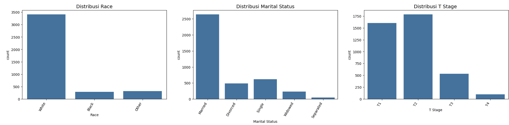

# Laporan Proyek Machine Learning Terapan - Tiesya Andriani Ramadhanti

## Domain Proyek: Kesehatan

### Latar Belakang
Kanker payudara merupakan penyebab kematian tertinggi akibat kanker pada perempuan di seluruh dunia. Meskipun banyak penelitian berfokus pada deteksi dini kanker payudara, tantangan besar lainnya adalah memahami dan memprediksi kelangsungan hidup pasien setelah diagnosis. Prediksi yang akurat terhadap kemungkinan seorang pasien bertahan hidup dapat membantu dalam perencanaan perawatan, pengambilan keputusan klinis, serta memfokuskan sumber daya medis secara lebih efektif.

Penerapan machine learning dalam bidang kesehatan telah menunjukkan potensi yang besar dalam meningkatkan akurasi diagnosis dan prognosis. Studi oleh Pires et al. (2021) menunjukkan bahwa algoritma machine learning seperti Support Vector Machine, Random Forest, dan Logistic Regression dapat mencapai akurasi tinggi dalam klasifikasi diagnosis kanker payudara (ganas atau jinak). Meskipun studi tersebut fokus pada tahap diagnosis, pendekatan yang sama dapat diperluas untuk prediksi kelangsungan hidup pasien, dengan menggunakan data klinis lanjutan seperti ukuran tumor, jumlah node limfa positif, dan lama bertahan hidup.

Dengan memanfaatkan data klinis dan algoritma machine learning, proyek ini bertujuan untuk membangun model prediksi yang dapat mengklasifikasikan pasien kanker payudara ke dalam dua kelompok utama: alive atau dead. Model ini diharapkan dapat membantu dalam penyusunan strategi perawatan yang lebih tepat sasaran dan personalisasi pengobatan bagi penderita kanker payudara.

### Referensi
- Pires, F. G., de Sousa, R. T., Ferreira, K. P., Andrade, R. M. C., & Pereira, A. G. (2021). Machine Learning Algorithms for Breast Cancer Prediction and Diagnosis. *Procedia Computer Science, 191*, 487–492. https://doi.org/10.1016/j.procs.2021.07.062

- World Health Organization. (2021). *Breast cancer*. Retrieved from https://www.who.int/news-room/fact-sheets/detail/breast-cancer

## Business Understanding

### Problem Statements

- Bagaimana memprediksi status kelangsungan hidup pasien kanker payudara (alive atau dead) berdasarkan data klinis seperti ukuran tumor, jumlah kelenjar getah bening positif, dan lama bertahan hidup?
- Apa saja fitur klinis yang paling berpengaruh terhadap prediksi status kelangsungan hidup pasien kanker payudara?
- Bagaimana cara meningkatkan akurasi prediksi untuk membantu pengambilan keputusan medis yang lebih baik?

### Goals

- Membangun model klasifikasi machine learning yang dapat memprediksi apakah pasien kanker payudara akan hidup atau meninggal berdasarkan fitur klinis.
- Mengidentifikasi variabel-variabel penting yang paling memengaruhi kelangsungan hidup pasien.
- Menyediakan solusi berbasis data yang dapat digunakan untuk mendukung keputusan medis dan rencana perawatan yang lebih personal.

### Solution Statements

Untuk mencapai tujuan proyek, pendekatan berikut dilakukan:

- Menerapkan dan membandingkan performa lima algoritma klasifikasi machine learning:
1. **AdaBoostClassifier** – algoritma boosting yang kuat untuk mengurangi bias dan varians.
2. **LinearDiscriminantAnalysis (LDA)** – model statistik klasik untuk klasifikasi dengan asumsi distribusi normal.
3. **RandomForestClassifier** – algoritma ensemble berbasis decision tree yang andal dan tahan terhadap overfitting.
4. **LogisticRegression** – model linear yang sederhana dan interpretable untuk klasifikasi biner.
5. **LGBMClassifier (LightGBM)** – algoritma gradient boosting yang cepat dan efisien untuk dataset skala besar.

- Melakukan proses *data preprocessing* seperti penghapusan outliers, encoding variabel kategorikal, undersampling dataset, dan pembagian data train-test.

- Melakukan evaluasi performa masing-masing model menggunakan metrik klasifikasi seperti:
  - **Accuracy** – untuk melihat proporsi prediksi benar.
  - **Precision dan Recall** – untuk memahami trade-off antara false positive dan false negative.
  - **F1-Score** – untuk menyeimbangkan precision dan recall terutama saat kelas tidak seimbang.
 
  
## Data Understanding

Dataset yang digunakan dalam proyek ini adalah "Breast Cancer" dari Kaggle:  
https://www.kaggle.com/datasets/reihanenamdari/breast-cancer

Dataset ini berisi informasi klinis dan demografis pasien kanker payudara, dengan tujuan untuk memprediksi status kelangsungan hidup pasien (`Status`: Alive atau Dead). Dataset terdiri dari 4.024 baris data dan 16 kolom fitur.

### Deskripsi Fitur

Berikut adalah penjelasan dari masing-masing fitur pada dataset:

- `Age`: Usia pasien dalam tahun.
- `Race`: Ras pasien (White, Black, Asian/Pacific Islander, dll).
- `Marital Status`: Status pernikahan pasien (Married, Single, Widowed, dll).
- `T Stage`: Stadium tumor primer berdasarkan ukuran (T1, T2, T3, dll).
- `N Stage`: Stadium nodus limfa regional (N0, N1, N2, dll).
- `6th Stage`: Stadium kanker menurut klasifikasi AJCC edisi ke-6 (misalnya IIA, IIB, IIIA).
- `differentiate`: Tingkat diferensiasi sel tumor (Well, Moderate, Poor, Undifferentiated).
- `Grade`: Tingkat keparahan sel kanker (1 = well differentiated, 2 = moderately differentiated, 3 = poorly differentiated).
- `A Stage`: Stadium kanker akhir (Stage I, II, III, IV).
- `Tumor Size`: Ukuran tumor dalam milimeter.
- `Estrogen Status`: Status reseptor estrogen (Positive/Negative).
- `Progesterone Status`: Status reseptor progesteron (Positive/Negative).
- `Regional Node Examined`: Jumlah kelenjar getah bening yang diperiksa.
- `Reginol Node Positive`: Jumlah kelenjar getah bening yang positif (mengandung sel kanker).
- `Survival Months`: Lama kelangsungan hidup pasien setelah diagnosis (dalam bulan).
- `Status`: Target variabel – status kelangsungan hidup pasien (`Alive` atau `Dead`).

Beberapa tahapan eksplorasi data telah dilakukan untuk memahami karakteristik dataset, antara lain:

 ## Eksplorasi Data

Beberapa tahapan eksplorasi data telah dilakukan untuk memahami karakteristik dataset, antara lain:

#### 1. Visualisasi Boxplot untuk Mengidentifikasi Outliers

  
Dari visualisasi boxplot terhadap fitur numerik seperti `Tumor Size`, `Regional Node Examined`, `Regional Node Positive`, dan `Survival Months`, ditemukan adanya sejumlah nilai pencilan (outliers). Outliers ini berpotensi mempengaruhi distribusi data dan performa model, sehingga perlu ditangani pada tahap preprocessing.

#### 2. Visualisasi Univariat: Distribusi Fitur

  
  
  
  
Visualisasi menggunakan countplot menunjukkan distribusi fitur kategorikal seperti `Race`, `Marital Status`, `T Stage`, dan `Status`. Beberapa insight yang ditemukan:

- Mayoritas pasien berasal dari ras `White`, diikuti oleh `Black` dan `Asian/Pacific Islander`.
- Sebagian besar pasien berada pada `T Stage` T2, yang mengindikasikan ukuran tumor sedang.
- Untuk `Status`, terdapat distribusi yang cukup berimbang antara pasien `Alive` dan `Dead`, meskipun sedikit lebih banyak yang `Alive`.

  
Distribusi fitur numerikal menunjukkan:

- `Age` terdistribusi antara 20 hingga 90 tahun, dengan konsentrasi pada usia 50–70 tahun.
- `Tumor Size` menunjukkan skew ke kanan, artinya sebagian besar tumor berukuran kecil hingga sedang, namun terdapat beberapa kasus tumor berukuran besar.
- `Survival Months` sangat bervariasi, namun terlihat beberapa outliers pada nilai survival yang sangat panjang atau sangat pendek.
- `Regional Node Examined` dan `Regional Node Positive` juga menunjukkan nilai-nilai ekstrim.

#### 3. Visualisasi Bivariat: Hubungan Fitur dan Target (`Status`)

  
  
  
  
Boxplot dan barplot digunakan untuk mengevaluasi hubungan antara fitur dan target `Status`:

- Pasien dengan `Tumor Size` yang lebih besar cenderung memiliki probabilitas lebih tinggi untuk berstatus `Dead`.
- Pasien dengan stadium lanjut (`T Stage` T3 atau `A Stage` III/IV) terlihat lebih sering berstatus `Dead` dibandingkan dengan pasien pada stadium awal.
- Nilai `Regional Node Positive` juga cenderung lebih tinggi pada pasien yang tidak bertahan hidup.

  
  
  
  
  
Hubungan antara `Survival Months` dan `Status` sangat jelas: pasien `Alive` cenderung memiliki waktu survival yang jauh lebih panjang dibanding yang `Dead`. Korelasi ini sangat penting dan dapat dimanfaatkan sebagai fitur prediktif kuat.

#### 4. Heatmap Korelasi Antar Variabel Numerik

  
Analisis korelasi antar fitur numerik mengungkap beberapa pola:

- Terdapat korelasi negatif yang cukup kuat antara `Status` (dalam bentuk binary encoded) dan `Survival Months`, yang sesuai dengan ekspektasi (pasien yang masih hidup memiliki nilai survival lebih tinggi).
- `Tumor Size` dan `Regional Node Positive` memiliki korelasi positif moderat, menunjukkan bahwa tumor besar cenderung menyebar ke lebih banyak node limfa.
- Korelasi antar fitur lainnya relatif rendah, menandakan bahwa sebagian besar fitur bersifat independen dan dapat berkontribusi unik terhadap model.

## Data Preparation

Tahapan data preparation sangat penting untuk memastikan bahwa data yang digunakan dalam proses pemodelan bersih, relevan, dan berada dalam format yang dapat diproses oleh algoritma machine learning. Pada proyek ini, langkah-langkah data preparation dilakukan secara sistematis dan berurutan sebagai berikut:

### 1. Menangani Outliers

Untuk memastikan kualitas data yang baik sebelum pelatihan model, langkah pertama adalah menangani outlier menggunakan metode **IQR (Interquartile Range)**. Langkah ini dilakukan dengan menghitung kuartil pertama (Q1) dan kuartil ketiga (Q3), kemudian menentukan batas bawah dan batas atas menggunakan rumus:

- **Lower Bound** = Q1 - 1.5 × IQR  
- **Upper Bound** = Q3 + 1.5 × IQR

  
Outlier yang ditemukan pada fitur seperti `Tumor Size`, `Survival Months`, dan `Regional Node Examined` dihapus untuk menjaga stabilitas distribusi data. Setelah penghapusan, jumlah sampel berkurang, namun data menjadi lebih representatif dan bebas dari nilai ekstrem.

### 2. Encoding Fitur Kategorikal

Karena sebagian besar fitur merupakan data kategorikal, dilakukan encoding agar dapat dibaca oleh algoritma machine learning:

- **Binary Encoding** pada target variabel:
  - `Status`: Alive → 1, Dead → 0

- **One-hot Encoding** diterapkan pada fitur-fitur kategorikal lainnya:
  - `Race`, `Marital Status`, `T Stage`, `N Stage`, `6th Stage`, `differentiate`, `Grade`, `A Stage`, `Estrogen Status`, `Progesterone Status`

### 3. Penyeimbangan Kelas (Undersampling)

Setelah eksplorasi awal terhadap variabel target (`Status`), ditemukan bahwa data tergolong **tidak seimbang**, dengan jumlah pasien yang `Alive` lebih banyak dibandingkan `Dead`.
Untuk menghindari bias model terhadap mayoritas kelas, dilakukan teknik **random undersampling** terhadap kelas mayoritas (`Alive`) agar jumlahnya seimbang dengan kelas minoritas (`Dead`).
Langkah ini penting untuk meningkatkan performa model terutama pada metrik **recall dan F1-score** pada kelas minoritas, serta menghindari hasil prediksi yang timpang.

### 4. Pembagian Dataset

Dataset yang telah dibersihkan dan diseimbangkan kemudian dibagi menjadi:

- **80% data latih**
- **20% data uji**

Pembagian dilakukan menggunakan `train_test_split` dari `sklearn.model_selection` dengan stratifikasi berdasarkan variabel `Status`, agar distribusi kelas tetap seimbang di kedua subset data.

### 5. Standardisasi Fitur Numerik

Beberapa fitur numerik memiliki skala yang sangat bervariasi, sehingga perlu distandarisasi agar memiliki skala yang seragam dan tidak mendominasi proses pelatihan model. Standarisasi dilakukan menggunakan `StandardScaler` dari scikit-learn, yang mengubah nilai setiap fitur menjadi distribusi dengan rata-rata 0 dan standar deviasi 1.

Fitur-fitur yang distandarisasi adalah sebagai berikut:
- `Age`
- `Tumor Size`
- `Regional Node Examined`
- `Reginol Node Positive`
- `Survival Months`

